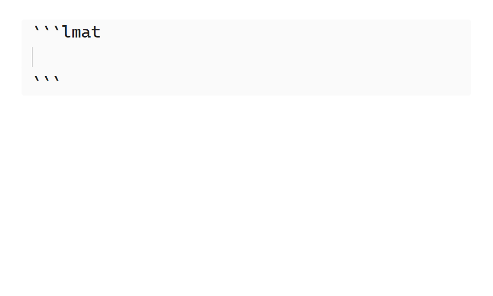

<div align="center">
  
  <h1 align="center">
  LaTeX Math

  

  <a> 
   

  </a>

  </h1>

</div>

**LaTeX Math** is an [Obsidian](https://obsidian.md/) plugin which adds mathematical evaluation of LaTeX math blocks to your notes, using [Sympy](https://www.sympy.org).


`Evaluate LaTeX expression` is bound to `Alt + B` in the above demo.
In general, all demo GIFs will make use of the [recommended hotkeys](#command-list).[^gifs-note]

[^gifs-note]: All demo GIFs were produced with the [Obsidian Latex Suite](https://github.com/artisticat1/obsidian-latex-suite) plugin installed.

## Usage

Start out by placing the cursor inside any math block. Then execute the `Evaluate LaTeX expression` command (or any other command from the [command list](#command-list)). **LaTeX Math** will now parse the latex math block, evaluate the equation, and insert the result at the end of the math block.

Take a look at the [command list](#command-list) a brief overview of what this plugin can do, or go look at the [features](#features) list, for a more in depth walkthrough of this plugin's advanced features.

<!-- omit in toc -->
## Table of Contents

- [Usage](#usage)
- [Command List](#command-list)
- [Features](#features)
  - [Evaluate](#evaluate)
  - [Solve](#solve)
  - [Symbol and Function Definitions](#symbol-and-function-definitions)
  - [Units and Physical Constants](#units-and-physical-constants)
  - [Symbol Assumptions](#symbol-assumptions)
  - [Logical Propositions](#logical-propositions)
  - [Convert To Sympy Code](#convert-to-sympy-code)
- [Installing](#installing)
  - [Installing a Specific Version](#installing-a-specific-version)
- [Contributing](#contributing)
  - [Developing the Cas Client](#developing-the-cas-client)
  - [Developing the Obsidian Plugin](#developing-the-obsidian-plugin)
- [License](#license)

## Command List

Below is a table of all the commands this plugin provides, along with a brief description of what it does and optionally a recommended hotkey.

| Command                                     | Recommended Hotkey | Usage                                                                                                                                             |
| ------------------------------------------- | :----------------: | ------------------------------------------------------------------------------------------------------------------------------------------------- |
| Evaluate LaTeX expression                   |     `Alt + B`      | Evaluate the right most expression (if in a relation) and simplify the result.                                                                    |
| Evalf LaTeX expression                      |     `Alt + F`      | Evaluate expression and output decimal numbers instead of fractions in the result.                                                                |
| Expand LaTeX expression                     |     `Alt + E`      | Evaluate expression and expand the result as much as possible.                                                                                    |
| Factor LaTeX expression                     |                    | Evaluate expression and factorize the result as much as possible.                                                                                 |
| Partial fraction decompose LaTeX expression |                    | Evaluate expression and perform partial fraction decomposition on the result.                                                                     |
| Solve LaTeX expression                      |     `Alt + L`      | Solve a single equation or a system of equations. Output the result in a new math block below the current one.                                    |
| Convert units in LaTeX expression           |     `Alt + U`      | Try to convert the units in the right most expression to the user supplied one.                                                                   |
| Create truth table from LaTeX expression    |                    | If selected expression is a proposition, inserts a truth table generated from the proposition. Table can be inserted as either latex or markdown. |
| Convert LaTeX expression to Sympy           |                    | Convert entire expression to its equivalent Sympy code, and insert the result in a code block below the current math block.                       |

## Features

### Evaluate

Evaluate equations in various ways using the evaluate command suite. The computed output varies, depending on the chosen command.

The entire evaluate suite consists of the following commands: `Evaluate LaTeX expression`, `Evalf LaTeX expression`, `Expand LaTeX expression`, `Factor LaTeX expression` and `Partial fraction decompose LaTeX expression`.

<!-- TODO: update this one so it uses the newest version -->


### Solve

Solve equations using the `Solve LaTeX expression` command.
To solve a system of equations, place them in a `align` or `cases` environment, separated by latex newlines (`\\\\`).

The solution domain can be restricted for single equations in the solve equation modal, see the [relevant Sympy documentation](https://docs.sympy.org/latest/modules/sets.html#module-sympy.sets.fancysets) for a list of possible values.[^lmat-solve-domain]
Restrict the solution domain of a system of equations with [symbol assumptions](#symbol-assumptions) on the free symbols.

[^lmat-solve-domain]: The default solution domain for single equations can be set via. The `domain` key in the `domain` table in an `lmat` environment.

<!-- TODO: update this one so it has a set solution (sin for example with a periodic solution domain) -->


### Symbol and Function Definitions

Define values of symbols or functions using the `:=` operator.
Only one symbol or function can be defined per math block.

Definitions persistence are location based, any math block below a definition will make use of it, all others will ignore it. Furthermore, all definitions are reset after an `lmat` code block.

To undefine a symbol or function, leave the right-hand side of the `:=` operator blank.


### Units and Physical Constants

Denote units or physical constants in equations by surrounding them with braces `{}`.
LaTeX Math automatically handles conversions between units, constants and their various prefixes. See the [syntax](SYNTAX.md#supported-units) document for a list of supported units and physical constants.

### Symbol Assumptions

Use an `lmat` code block to tell **LaTeX Math** about various assumptions it may make about specific symbols. This is used to further simplify expressions, such as roots, or limit the solution domain of equations. By default, all symbols are assumed to be complex numbers.

`lmat` code blocks make use of the [TOML](https://toml.io) config format. To define assumptions for a symbol, assign the symbol's name to a list of assumptions LaTeX Math should make, under the `symbols` table. Like definitions, an `lmat` code block's persistence is based on its location. See below the demo GIF for a simple static `lmat` code block example.



> [!TIP]
> **Example**
>
> ````text
> ```lmat
> [symbols]
> x = [ "real", "positive" ]
> y = [ "integer" ]
> ```
> ````

See the [Sympy documentation](https://docs.sympy.org/latest/guides/assumptions.html#id28) for a list of possible assumptions.

### Logical Propositions

Simplify logical propositions using the [evaluate commands](#evaluate). Truth tables can be generated from a logical proposition using the `Create truth table from LaTeX expression` commands.

See [SYNTAX.md/Logical Operators](SYNTAX.md#logical-operators) for a list of logical operators.

> [!TIP]
> Want to check if two expressions are equal?
>
> Put an `\iff` in between them and upon [evaluation](#evaluate), **LaTeX Math** will insert `True` if they are symbolically equal or otherwise `False` if they are not.

### Convert To Sympy Code

Quickly convert latex to Sympy code to perform more advanced computations using the `Convert LaTeX expression to Sympy` command.
This will insert a python code block containing the equivalent Sympy code of the selected math block.

## Installing

Press `Browse` in obsidians `Options > Community plugins` menu and search for `LaTeX Math`.

### Installing a Specific Version

An earlier or beta version of this plugin can be installed via. 2 methods.

#### BRAT Installation (easy)

- Make sure the [BRAT plugin](https://obsidian.md/plugins?id=obsidian42-brat) is installed in your obsidian vault.
- Run the `BRAT: Plugins: Add a beta plugin for testing (with or without version)` command via. the command palette.
- Paste the **LaTeX Math** repository link (https://github.com/zarstensen/obsidian-latex-math) in the `Repository` text field.
- Select the desired version in the `version` dropdown.
- Press the `Add plugin` button.

The desired plugin version should now be installed in your vault.

#### Manual Installation

- Download the `plugin.zip` file from the [desired release version](https://github.com/zarstensen/obsidian-latex-math/releases).
- Extract it to your vault's plugin folder, commonly located at `.obsidian/plugins`, relative to your vault's path.

The desired plugin version should now be installed in your vault.

## Contributing

Planning to make a contribution to this plugin? If so, please make sure to check-out and make PR's to the `dev` branch.

The only exception to this are hotfixes, which should be merged into `main`.

Want to make changes to UI / UX? Checkout the `src` folder for the obsidian plugin.

Want to expand upon the CAS features of this plugin? Checkout the `lmat-cas-client` folder for the cas clients source code.

The following sections describe how to set up a development environment for **LaTeX Math**.
Make sure to have python (for cas client development) and / or NPM (for obsidian plugin development) installed before continuing.

### Developing the Cas Client

Start of with running the `setup-dev-env` python script from the root directory.

```sh
python setup-dev-env.py
```

This creates a virtual environment named `.venv` installed with all required dependencies. Furthermore, it sets up a git pre-push hook, which runs the entire test suite, before pushing.

To use this development environment in Obsidian, go to the **LaTeX Math** settings in the vault this repo has been cloned to, and toggle the `Developer Mode` switch to on. Make sure to reload the vault after doing this.

The plugin should now use the python source files and the created virtual environment, instead of the auto installed `lmat-cas-client` binary.

Any changes to the python source code requires reloading Obsidian to have any effect.

> [!CAUTION]
> If you are using VS Code as an IDE, make sure to add `push` as an entry to `git.commandsToLog` in VS Code (user or workspace), if you want to see the output of the push hook if it fails.

### Developing the Obsidian Plugin

Start out by downloading the [`bundle-bin.zip`](https://github.com/zarstensen/obsidian-latex-math/releases/latest) file from the latest release, and extract it in the root directory.

Now run `npm -i` still in the root directory.

To start auto building the project on any source code change, run `npm run dev`.
To perform a one-time production ready build, run `npm run build`.

## License

See [LICENSE](LICENSE)
