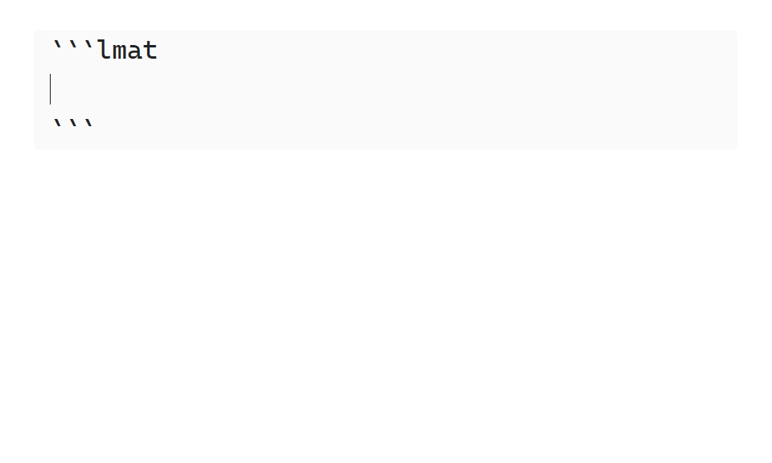

# Feature Showcase

This page provides a brief overview of **LaTeX Math**'s main features, along with simple usage examples to get you started with using them.

## Evaluate Math Blocks

Use the **evaluate** command suite to evaluate the content of a math block in various ways.
The output *format* depends on the chosen command, you will in most cases use `Evaluate LaTeX expression`, which simplifies the result as much as possible, before inserting it.

The entire evaluate suite consists of the following commands: `Evaluate LaTeX expression`, `Evalf LaTeX expression`, `Expand LaTeX expression`, `Factor LaTeX expression` and `Apart LaTeX expression`.

<!-- TODO: update this one so it uses the newest version -->

> ++alt+b++: `Evalaute LaTeX Expression`; ++alt+f++: `Evalf LaTeX expression`; ++alt+e++: `Expand LaTeX expression`

A detailed walkthrough of the commands can be found in section [???](???) in the tutorial.

## Solve Equation(s)

Solve equations using the `Solve LaTeX expression` command.
System of equations can also be solved, by placing them in an `align` or `cases` environment, separated by latex newlines(`\\`).


<!-- TODO: update this one so it has a set solution (sin for example with a periodic solution domain) -->


For more info on solving equations, check out the [???](???) tutorial or the [???](???) reference.

## Define Symbols and Functions

Define symbol values or function bodies with the `:=` operator.

Definitions persistence are location-based. Any math block below a definition will use it; others will ignore it. Furthermore, all definitions are reset after an [`lmat`](???) code block.

Only one symbol or function can be defined per math block.

> $n'th$ Fibonacci number definition.
 
To undefine a symbol or function, leave the right-hand side of the `:=` operator blank.

## Use Units and Physical Constants

Denote SI units and physical constants by wrapping their name in braces `{..}`. **LaTeX Math** automatically handles converting between units, but if you are not satisfied with the result, you can manually specify which units to convert to by running the `Convert units in LaTeX expression` command.
> [!example] Units Example
>
> ```latex
> 60 \frac{{km}}{{h}} \cdot 180 {s} 
> -- Evaluatle LaTeX Expression --
> 60 \frac{{km}}{{h}} \cdot 180 {s} = 3 {km}
> ```

See the [units and constants](https://github.com/zarstensen/obsidian-latex-math/blob/main/docs/SYNTAX.md#supported-units) page, for a list of supported units and physical constants.

## Enforce Symbol Assumptions

Use `lmat` code blocks to tell **LaTeX Math** about various assumptions it should make about specific symbols. This enables further simplification of expressions, such as roots, or limits the solution domain when [solving](#solve-equations) equations. By default, all symbols are assumed to be *complex* numbers.

`lmat` code blocks make use of the [TOML](https://toml.io) config format. To define assumptions for a symbol, assign the symbol's name to a list of assumptions LaTeX Math should make, under the `symbols` table. Like definitions, an `lmat` code block's persistence is based on its location. See below the demo GIF for a simple static `lmat` code block example.



> [!example]
> ````text
> ```lmat
> [symbols]
> x = [ "real", "positive" ]
> y = [ "integer" ]
> ```
> ````

You can read more about **LaTeX Math** environments and the `lmat` code block [in the docs](https://github.com/zarstensen/obsidian-latex-math/blob/main/docs/LMAT_ENV.md).

See the [Sympy documentation](https://docs.sympy.org/latest/guides/assumptions.html#id28) for a list of possible assumptions.

## Simplify Logical Propositions

Simplify logical propositions using the [evaluate commands](#evaluate-math-blocks). Truth tables can be generated from a logical proposition using the `Create truth table from LaTeX expression` commands.
-math-blocks
> [!example] Logic Example
>
> ```latex
> (A \land B) \implies (A \lor C)
> -- Evaluatle LaTeX Expression --
> (A \land B) \implies (A \lor C) \equiv \mathrm{T}
> ```

See [SYNTAX.md/Logical Operators](https://github.com/zarstensen/obsidian-latex-math/blob/main/docs/SYNTAX.md#logical-operators) for a list of logical operators and constants.

> [!tip]
> Want to check if two expressions are equal?
>
> Put an `\iff` in between them and upon [evaluation](#evaluate-math-blocks), **LaTeX Math** will insert `True` if they are symbolically equal or otherwise `False` if they are not.

## Convert To Sympy

Quickly convert math blocks into Sympy code with the `Convert LaTeX expression to Sympy` command.
This will insert a python code block containing the equivalent Sympy code of the selected math block.

> [!example] Sympy Example
>
> ````latex
> \begin{bmatrix} 1 & 2 \\ 3 & 4 \end{bmatrix}
> -- Convert LaTeX expression to Sympy --
> ```python
> Matrix([[1, 2], [3, 4]])
> ```
> ````
